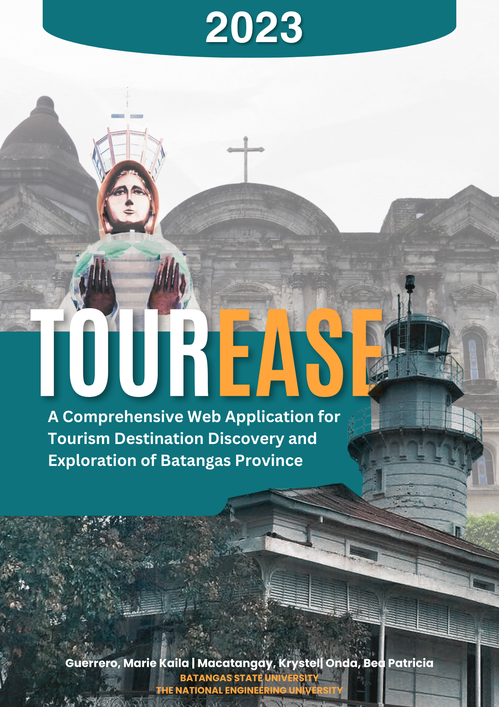
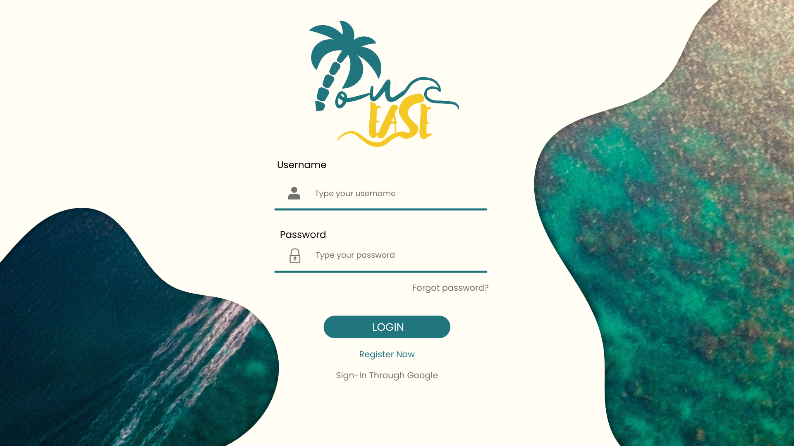

<a name="readme-top"></a>
<!-- PROJECT LOGO -->

<div align="center">
  <a>
    
  </a>

  <h1 align="center" >T O U R E A S E</h1>

  <h2 align="center"> A Comprehensive Web Application for <br>Tourism Destination Discovery and Exploration of Batangas Province<br /></h2>
</div>

<!-- TABLE OF CONTENTS -->
<details>
  <summary>Table of Contents</summary>
  <ol>
    <li>
      <a href="#about-the-project">About The Project</a>
      <ul>
        <li><a href="#built-with">Built With</a></li>
      </ul>
    </li>
    <li>
      <a href="#getting-started">Getting Started</a>
      <ul>
        <li><a href="#prerequisites">Prerequisites</a></li>
        <li><a href="#installation">Installation</a></li>
      </ul>
    </li>
    <li><a href="#usage">Usage</a></li>
    <li><a href="#contact">Contact</a></li>
    <li><a href="#references">References</a></li>
  </ol>
</details>


<!-- ABOUT THE PROJECT -->
## ABOUT THE PROJECT

The project aims to address the challenges faced by tourists visiting Batangas province in the Philippines. Batangas is a popular tourist destination known for its scenic beaches, dive spots, heritage sites, and natural attractions. However, the lack of centralized and up-to-date information about the province's tourist attractions and the absence of a reliable navigation system make it difficult for tourists to plan their trips effectively and fully enjoy their experiences.

To overcome these issues and promote tourism in the region, the project proposes the development of a web application. This application will serve as an integrated platform for travelers, providing thorough and current information about the tourist spots in Batangas. By offering comprehensive details, the platform will help tourists make informed decisions, plan their itineraries, and locate various attractions with ease.

One of the key modules of the web application is the registration of tourist spots in Batangas province. This step is crucial for improving the tourist experience, attracting more visitors, and benefiting the local tourism and business sectors financially. By centralizing information and ensuring its accuracy, the project aims to eliminate the fragmented picture of the province's tourist attractions caused by inconsistent or outdated information sources.

The project also emphasizes the use of innovation and technology to achieve its objectives. By providing a user-friendly and reliable navigation system, the web application enhances the overall tourist experience and promotes the province's tourism offerings. Additionally, the project focuses on safety measures to create a secure atmosphere for tourists, addressing their concerns about unforeseen circumstances and ensuring prompt access to assistance when needed.

Ultimately, the project seeks to support the growth of tourism in Batangas province by providing a comprehensive and user-friendly platform that benefits both tourists and the local economy.

<p align="right">(<a href="#readme-top">back to top</a>)</p>

### Built With

This section is the list of the frameworks/librararies and programming language used in the project. 

* [![Ionic][Ionic-shield]][Ionic-url]
       <p>Ionic is an open source UI toolkit for building performant, high-quality mobile apps using web technologies — HTML, CSS, and JavaScript — with integrations for popular frameworks like Angular.</p>
* [![Angular][Angular.io]][Angular-url]
       <p>Angular is a platform and framework for building single-page client applications using HTML and TypeScript. Angular is written in TypeScript. It implements core and optional functionality as a set of TypeScript libraries that you import into your applications.</p>
* [![HTML][HTML-shield]][HTML-url]
      <p>HTML is heavily used for creating pages displayed on the world wide web. Every page contains a set of HTML tags, including hyperlinks used for connecting to other pages. Every page that we witness on the world wide web is written using a version of HTML code.</p>
* [![CSS][CSS-shield]][CSS-url]
      <p>With CSS, you can control the color, font, the size of text, the spacing between elements, how elements are positioned and laid out, what background images or background colors are to be used, different displays for different devices and screen sizes, and much more!</p>
* [![TypeScript][TypeScript-shield]][TypeScript-url]
      <p>TypeScript extends JavaScript and improves the developer experience. It enables developers to add type safety to their projects. Moreover, TypeScript provides various other features, like interfaces, type aliases, abstract classes, function overloading, tuple, generics, etc.</p>
* [![JavaScript][JavaScript-shield]][Javascript-url]
      <p>JavaScript is a scripting language that enables you to create dynamically updating content, control multimedia, animate images, and pretty much everything else.</p>

<p align="right">(<a href="#readme-top">back to top</a>)</p>

<!-- GETTING STARTED -->
## GETTING STARTED

_To set the system up, given the following pre-requisites and installation guide to set up the project locally.
To get a local copy up and running follow these simple example steps._

### Prerequisites

This is an example of how to list things you need to use the software and how to install them.
* npm
  ```sh
  npm install npm@latest -g
  ```
* @ionic/cli
  ```sh
  npm install –g @ionic/cli
  ```
* swiper
  ```sh
  npm install swiper
  ```

### Installation

_To begin with the installation, follow these steps._

1. Get a free API Key at [https://example.com](https://example.com)
2. Clone the repository
   <br>2.1. Copy the repository URL from GitHub
   <br>2.2. Open a terminal or command prompt on your local machine.
   <br>2.3. Navigate to the directory where you want to store the project.
   <br>2.4. Run the following command,
     ```sh
        git clone https://github.com/beaonda/TourEase.git
     ```
   <br>2.5. Press Enter to clone the repository to your local machine.
3. Install Dependencies
    <br>3.1. Navigate to the project directory using the terminal or command prompt.
    <br>3.2. Check if there is a file named package.json. If it exists, the project likely has dependencies.
    <br>3.3. Run the following command to install the project dependencies:
     ```sh
         npm install
     ```
    <br>3.4. Wait for the installation to complete. This command will install the required libraries and packages specified in the package.json file.
4. Enter your API in `config.js`
     ```js
     const API_KEY = 'ENTER YOUR API';
     ```
5. Run the Project
     <br>5.1. After the installation and configuration steps are complete, you should be ready to run the project.
     <br>   Run the project using this command
     ```sh
         ionic serve
     ```

<p align="right">(<a href="#readme-top">back to top</a>)</p>

<!-- USAGE EXAMPLES -->
## USAGE
_To know more about this project, please refer to the [TourEase Documentation](https://docs.google.com/document/d/1L8hJNHm3O3NgJ9D71wyEEuiUWLOrotuyZ7ykCiSjHZ8/edit?usp=drive_link)_
<br>Below shows the sample screenshots, code examples and demos work.



<p align="right">(<a href="#readme-top">back to top</a>)</p>

<!-- CONTACT -->
## CONTACT

PROJECT LINK: [TourEase](https://github.com/beaonda/TourEase)<br>
PROJECT DOCUMENTATION : [Documentation](https://docs.google.com/document/d/1L8hJNHm3O3NgJ9D71wyEEuiUWLOrotuyZ7ykCiSjHZ8/edit?usp=drive_link)

* Front-End Developer/Documenter<br>
    [Marie Kaila G. Guerrero](https://github.com/guerrerokai) 
* Front-End Developer/Documenter<br>
    [Krystel M. Macatangay](https://github.com/guerrerokai) 
* Full Stack Developer/Documenter<br>
    [Bea Patricia F. Onda](https://github.com/beaonda) 

<p align="right">(<a href="#readme-top">back to top</a>)</p>

<!-- ACKNOWLEDGMENTS -->
## REFERENCES

In this section are the list of resources that you may also find helpful and we would like to give credit to. We've included a few of our favorites to kick things off!

* [React Icons](https://react-icons.github.io/react-icons/search)
* [Ionic Framework](https://ionicframework.com/)
* [Canva](https://canva.com/)
* [Choose an Open Source License](https://choosealicense.com)
* [GitHub Emoji Cheat Sheet](https://www.webpagefx.com/tools/emoji-cheat-sheet)
* [Malven's Flexbox Cheatsheet](https://flexbox.malven.co/)
* [Malven's Grid Cheatsheet](https://grid.malven.co/)
* [Img Shields](https://shields.io)
* [GitHub Pages](https://pages.github.com)
* [Font Awesome](https://fontawesome.com)

<p align="right">(<a href="#readme-top">back to top</a>)</p>

<!-- MARKDOWN LINKS & IMAGES -->
<!-- https://www.markdownguide.org/basic-syntax/#reference-style-links -->
[contributors-shield]: https://img.shields.io/github/contributors/othneildrew/Best-README-Template.svg?style=for-the-badge
[contributors-url]: https://github.com/othneildrew/Best-README-Template/graphs/contributors
[Ionic-shield]: https://img.shields.io/badge/Ionic-7.1.1-blue
[Ionic-url]: https://ionicframework.com/
[Angular.io]: https://img.shields.io/badge/Angular-DD0031?style=for-the-badge&logo=angular&logoColor=white
[Angular-url]: https://angular.io/
[HTML-shield]: https://img.shields.io/badge/HTML-5-orange
[HTML-url]: https://www.w3.org/html/
[CSS-shield]: https://img.shields.io/badge/CSS-purple
[CSS-url]: https://www.w3.org/Style/CSS/
[TypeScript-shield]: https://img.shields.io/badge/TypeScript-lightblue
[TypeScript-url]:https://www.typescriptlang.org/
[JavaScript-shield]: https://img.shields.io/badge/JavaScript-yellow
[JavaScript-url]: https://developer.mozilla.org/en-US/docs/Web/JavaScript

